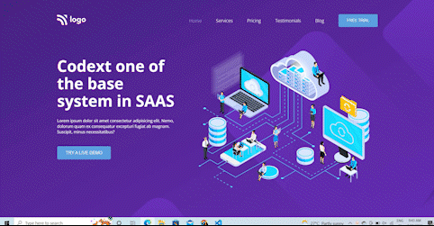

# Assignment-13 
## (SAAS landing Page) 

> In this project, I have used HTML (the Hypertext Markup Language) and CSS (Cascading Style Sheets), which are two of the core technologies for building Web pages. It is a responsive page.

### As a result of this project, I learn the following:
[LIVE-LINK](https://projectsaas.netlify.app/)

- [x] Learned to use flex and grid for layout
- [x] adding svg images in this project
- [x] adding box shadow on card

#### The duration of the project:2 hour